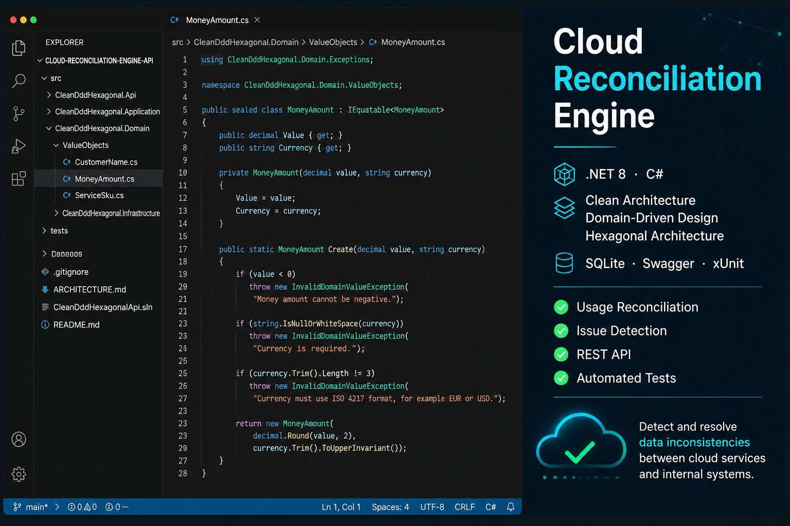

<h1 align="center">Cloud Reconciliation Engine</h1>

  <b>Cloud usage reconciliation API built with .NET 8, Clean Architecture, DDD and Hexagonal Architecture.</b>

  
  
  
  

  

---

## 🧠 About the Project

Cloud Reconciliation Engine is a backend API focused on detecting inconsistencies between internal cloud usage records and external provider data.

The goal of this project is not to build a large UI, but to model a real backend problem where data consistency, domain rules and maintainable architecture matter.

The system focuses on:

- Reconciling usage records from different sources
- Detecting mismatches in amount, currency and service SKU
- Modeling business rules with Value Objects
- Keeping domain logic independent from infrastructure
- Providing a testable and maintainable backend structure

---

## 🧪 Engineering Focus

This project prioritizes:

- Correctness over feature quantity
- Explicit domain modeling
- Clear architectural boundaries
- Testable business rules
- Simple and predictable API behavior

---

## 🚀 Quick Start

    git clone https://github.com/Saquero/cloud-reconciliation-engine-api.git
    cd cloud-reconciliation-engine-api
    dotnet restore
    dotnet run --project src/CleanDddHexagonal.Api --urls "http://localhost:5214"

API:
http://localhost:5214

Swagger:
http://localhost:5214/swagger

---

## ✨ Features

- Usage reconciliation between internal and external cloud records
- Issue detection for amount, currency and service SKU mismatches
- Clean separation between Domain, Application, Infrastructure and API layers
- Domain modeling with Entities, Value Objects and domain exceptions
- REST API documented with Swagger
- Automated tests with xUnit
- SQLite persistence for local development

---

## 🧱 Architecture

    API Layer
    └── Controllers / HTTP endpoints

    Application Layer
    └── Use Cases / DTOs / Ports

    Domain Layer
    └── Entities / Value Objects / Domain rules / Exceptions

    Infrastructure Layer
    └── EF Core / Persistence / Repositories / External services

---

## 📁 Project Structure

    src/
    ├── CleanDddHexagonal.Api/
    ├── CleanDddHexagonal.Application/
    ├── CleanDddHexagonal.Domain/
    └── CleanDddHexagonal.Infrastructure/

    tests/
    └── CleanDddHexagonal.Tests/

---

## ⚙️ Run Locally

    dotnet restore
    dotnet build
    dotnet test
    dotnet run --project src/CleanDddHexagonal.Api --urls "http://localhost:5214"

---

## 📡 API Overview

### Reconciliation

POST  /api/reconciliation/run  
GET   /api/reconciliation/issues/open  
PATCH /api/reconciliation/issues/{id}/resolve  

### Usage Records

POST /api/usage/internal  
POST /api/usage/external  

---

## 🧰 Tech Stack

| Area | Tech |
|------|------|
| Language | C# / .NET 8 |
| API | ASP.NET Core |
| Architecture | Clean Architecture · DDD · Hexagonal Architecture |
| Persistence | Entity Framework Core |
| Database | SQLite |
| Testing | xUnit |
| Docs | Swagger / OpenAPI |

---

## 🧩 Design Principles

- Clean Architecture
- Domain-Driven Design
- Hexagonal Architecture
- Repository Pattern
- Use Cases
- Value Objects
- Domain Exceptions

---

## 🧪 Testing

Run tests:

    dotnet test

Current status:
14/14 tests passing

---

## 🎯 Roadmap

- Add PostgreSQL support
- Add Docker Compose for local infrastructure
- Add authentication and API security
- Integrate real Azure Cost Management API
- Integrate real AWS Cost Explorer API
- Add reconciliation dashboard
- Improve reconciliation rules and detection engine

---

## 📚 Documentation

- Architecture notes: ARCHITECTURE.md
- Swagger available locally at: /swagger

---

## 📬 Contact

💼 Project created by Manu Saquero 👉 [**Manu Saquero**](https://www.linkedin.com/in/manusaquero/)  

🧠 Software Developer  
🚀 Apasionado por crear productos reales
