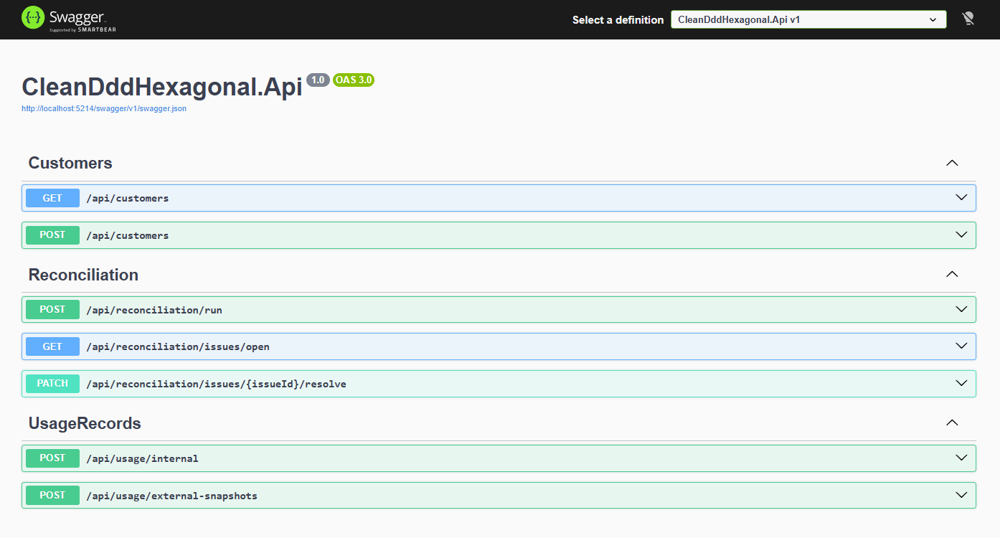

## 🚀 Demo Flow



# 🚀 Cloud Reconciliation Engine API

A professional backend project built with **C#**, **.NET 8**, **Clean Architecture**, **Domain-Driven Design (DDD)** and **Hexagonal Architecture**.

---

## 💡 Overview

This project simulates a real-world SaaS/cloud operations problem:

> Detecting mismatches between internal system records and external cloud provider data before they become billing or provisioning issues.

---

## ⚠️ Real Scenario

```text
Internal system:
Customer has 20 Microsoft 365 licenses

External provider:
Customer has 23 licenses

→ Result: Reconciliation issue detected
🧠 What this project demonstrates
Clean Architecture (layer separation)
Domain-Driven Design (DDD patterns)
Hexagonal Architecture (Ports & Adapters)
Domain Events for business actions
Real SaaS/cloud business logic (NOT CRUD)
Architecture tests to prevent coupling
🏗️ Architecture
API → Application → Domain
       ↑
Infrastructure (EF Core, DB, etc.)
🧱 Tech Stack
C#
.NET 8
ASP.NET Core Web API
Entity Framework Core
SQLite
Swagger
xUnit + NetArchTest
⚡ Quick Start

Clone and run locally:

git clone https://github.com/Saquero/cloud-reconciliation-engine-api.git
cd cloud-reconciliation-engine-api
dotnet restore
dotnet run --project src/CleanDddHexagonal.Api

Open Swagger:

http://localhost:PORT/swagger

(Use the port shown in the terminal)

🖼️ Demo (Swagger)

🧪 Demo Flow
Create customer
Register internal usage (20 seats)
Import external snapshot (23 seats)
Run reconciliation
System detects mismatch
Resolve issue
📡 API Endpoints
Method	Endpoint	Description
GET	/api/customers	List customers
POST	/api/customers	Create customer
POST	/api/usage/internal	Internal usage
POST	/api/usage/external-snapshots	External snapshot
POST	/api/reconciliation/run	Run reconciliation
GET	/api/reconciliation/issues/open	Get issues
PATCH	/api/reconciliation/issues/{id}/resolve	Resolve issue
🧠 Key Design Decisions
Business logic isolated in Domain layer
EF Core only used in Infrastructure
System time abstracted (IDateTimeProvider)
Domain events used for important actions
Controllers kept thin
🧪 Architecture Tests

Ensures:

Domain ❌ does NOT depend on Infrastructure
Domain ❌ does NOT depend on API
Application ❌ does NOT depend on Infrastructure
💼 Portfolio Summary

Built a .NET 8 Cloud Reconciliation Engine using Clean Architecture, DDD and Hexagonal Architecture to detect billing and provisioning mismatches in cloud environments.

🚀 Future Improvements
Docker support
Background jobs (auto reconciliation)
Logging (Serilog)
PostgreSQL support
CI/CD
